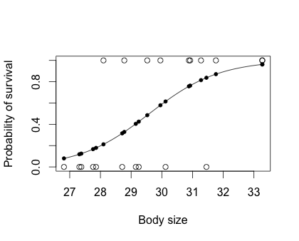

Logistic Regression 
========================================================


Logistic regression is a method for fitting a curve, y = f(x), when y consists of proportions, probabilities, or binary coded (0,1--failure,success) data. When the response is a binary (dichotomous) variable, and x is numerical, logistic regression fits a logistic curve to the relationship between x and y. The logistic curve is an S-shaped or sigmoid curve. 

Logisitic regression is often used to model:
* population growth
* survival from a disease
* the spread of a disease


A simplified version logistic function looks like:
``` r
logistic <- function(t) 1 / (1 + exp(-t))
```
Here, `t` is a numeric variable, and the result of `1 / (1 + exp(-t))` is saved as the variable `logistic`. 


Useful functions in R for modeling logisitic regression
========================================================

`glm(x ~ y, data= z, family=binomial )`

* `x`: response variable
* `y`: explanatory variables
* `z`: table or matrix containing `x` and `y`

`predict()`
The `predict()` function can be used to determine predicted outcomes, `y`, given a input variable, `x` for data that fits a  logistic regression model. These predicted outcomes can used to asses the accuracy of a logisitic regression model of a given data set. 

Example: generating data that fits logistic regression model
========================================================

```r

N <- 1e2

sim_cancer <- function(N){
  logistic <- function(t) 1 / (1 + exp(-t))

	carcinogens <- runif(N, min=0, max=100)
	age <- sample(10:99, N, replace=T)
	score <- 0.1 * (carcinogens - mean(carcinogens)) + 
			0.01 * (age - mean(age)) - 2
	prob <- logistic(score)
	cancer <- factor(ifelse(prob > runif(N), "Yes", "No"))
	
	data.frame(age, carcinogens, cancer)
}


d1 <- sim_cancer(N)

fit1 <- glm(cancer ~ I(carcinogens - mean(carcinogens)) + I(age - mean(age)) + 1, 
		data=d1, family="binomial")
```
```r
> summary(fit1)

Call:
glm(formula = cancer ~ I(carcinogens - mean(carcinogens)) + I(age - 
    mean(age)) + 1, family = "binomial", data = d1)

Deviance Residuals: 
     Min        1Q    Median        3Q       Max  
-1.84371  -0.32004  -0.09734   0.37629   2.23372  

Coefficients:
                                    Estimate Std. Error z value Pr(>|z|)    
(Intercept)                        -1.982406   0.513269  -3.862 0.000112 ***
I(carcinogens - mean(carcinogens))  0.103858   0.020974   4.952 7.36e-07 ***
I(age - mean(age))                  0.002565   0.014268   0.180 0.857324    
---
Signif. codes:  0 ‘***’ 0.001 ‘**’ 0.01 ‘*’ 0.05 ‘.’ 0.1 ‘ ’ 1

(Dispersion parameter for binomial family taken to be 1)

    Null deviance: 125.374  on 99  degrees of freedom
Residual deviance:  55.375  on 97  degrees of freedom
AIC: 61.375

Number of Fisher Scoring iterations: 6
```

Example: plot logistic regression
========================================================
```r
bodysize=rnorm(20,30,2)
bodysize=sort(bodysize)
survive=c(0,0,0,0,0,1,0,1,0,0,1,1,0,1,1,1,0,1,1,1)
dat=as.data.frame(cbind(bodysize,survive))
```
```r
> dat
   bodysize survive
1  24.69261       0
2  26.25943       0
3  27.18784       0
4  27.64657       0
5  27.71291       0
6  28.09373       1
7  28.48586       0
8  28.58804       1
9  28.59864       0
10 28.82595       0
11 29.20347       1
12 29.46498       1
13 29.62545       0
14 29.79508       1
15 30.49525       1
16 30.71303       1
17 31.03102       0
18 31.72150       1
19 32.17504       1
20 32.75737       1
```
```r
plot(bodysize,survive,xlab="Body size",ylab="Probability of survival") # plot with body size on x-axis and survival (0 or 1) on y-axis
g=glm(survive~bodysize,family=binomial,dat) # run a logistic regression model (in this case, generalized linear model with logit link). see ?glm

curve(predict(g,data.frame(bodysize=x),type="resp"),add=TRUE) # draws a curve based on prediction from logistic regression model

points(bodysize,fitted(g),pch=20) 
```

 


