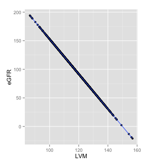
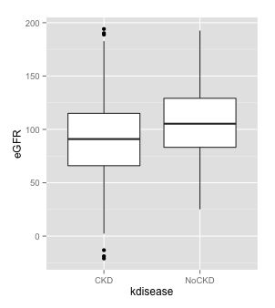
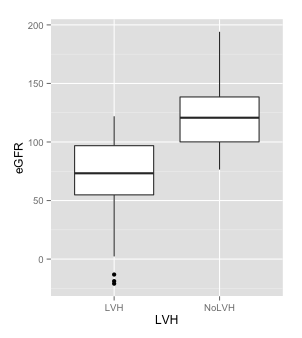

#Data Simulartion Assignment

##Introduction

Results of this studiy showed that both insulin resistance (IR) and left ventricular hypertrophy (LVH) existed in early stage early stage chronic kidney disease (CKD) patients. The prevalence of LVH in patients with IR was significantly higher than those without, and patients with LVH had a higher prevalence of IR than those without. The patients with IR or LVH had lower levels of stimated glomerular filtration rate (e-GFR). HOMA-IR had positive correlations with left ventricular mass index (LVMI). Homeostasis  model  assessment  of  insulin  resistance (HOMA-IR)  and Left ventricular mass (LVMI) had negative correlations with e-GFR. Both IR and LVH existed in early stage CKD patients and were more severe with the development of CKD. IR had a significant correlation with LVH. Furthermore, decline of e-GFR, hypertension and anemia were also associated with both IR and LVH and may have some effects in the mechanism of IR on the development of LVH.

[Effects of insulin resistance on left ventricular hypertrophy in patients with CKD stage 1-3](http://www.ncbi.nlm.nih.gov/pubmed/24839054)

IR: insulin resistance
CKD: chronic kidney disease
LVH: left ventricular hypertrophy

##Simulate a data set

Features:
* Sex
* Age
* Chronic kidney disease (`kdisease`)
* Homeostasis  model  assessment  of  insulin  resistance (`HOMA_IR_score`)
* Insulin resistence (`IR`)
* Left ventricular mass (`LVM`)
* Estimated glomerular filtration rate(`eGFR`)

How are these features related to left ventricular hypertrophy?

##Generate data
```r
generate_dataset <- function(N){ 
  
  sex <- sample(c("M", "F"), N, replace=TRUE, prob=c(0.5, 0.5))
  
  age <- runif(N,14,88)
  
  kdisease <- sample(c("CKD", "NoCKD"), N , replace=TRUE, prob=c(0.5, 0.5))
  
  HOMAmean <- c(CKD=2.16, NoCKD=1.87)  
  HOMAsd <- c(CKD=0.64, NoCKD=0.21)
  HOMAIRscore <- rnorm(N,mean=HOMAmean[kdisease], sd=HOMAsd[kdisease])
  
  IR <- ifelse(HOMAIRscore>2.284, "IR", "NoIR")
  
  eGFRmean<-c(IR=68.27, NoIR=107.51)
  eGFRsd<-c(IR=32.51, NoIR=32.90)
  eGFR <- rnorm(N,mean=eGFRmean[IR], sd=eGFRsd[IR])
  
  sim_LVM<- function(eGFR) { 
    150-0.327*eGFR 
    
  }
  
  LVM <- sim_LVM(eGFR)
  
  LVHcutoff<- c(F=110, M=125)
  
  LVH <- ifelse(LVM > LVHcutoff[sex], "LVH","NoLVH")

  
  data.frame(sex, age, kdisease, eGFR,IR, HOMAIRscore, LVM,LVH)
     
}
patient_df<-generate_dataset(1000)
```

##Exploratory analysis
 As all this paper suggets, CKD, IR and LVH, eGFR, and LVM are all related to each other. The following graph are generated in order to better show the relationship between variables in this data set. 

`plot_LVM_eGFR<- ggplot(data=patient_df,aes(x=LVM, y=eGFR))+ geom_point()+ geom_smooth(method=lm)`


`plot_kdisease_eGFR<-ggplot(data=patient_df,aes(x=kdisease, y=eGFR))+ geom_boxplot()`


`plot_LVH_eGFR<-ggplot(data=patient_df,aes(x=LVH, y=eGFR))+ geom_boxplot()`


##Regression analysis

```r
fit <- lm(LVM~ eGFR, data=patient_df)
summary(fit)
```
```r
Call:
lm(formula = LVM ~ eGFR, data = patient_df)

Residuals:
       Min         1Q     Median         3Q        Max 
-4.206e-12  2.000e-16  5.600e-15  1.010e-14  2.230e-14 

Coefficients:
              Estimate Std. Error    t value Pr(>|t|)    
(Intercept)  1.500e+02  1.278e-14  1.173e+16   <2e-16 ***
eGFR        -3.270e-01  1.231e-16 -2.656e+15   <2e-16 ***
---
Signif. codes:  0 ‘***’ 0.001 ‘**’ 0.01 ‘*’ 0.05 ‘.’ 0.1 ‘ ’ 1

Residual standard error: 1.362e-13 on 998 degrees of freedom
Multiple R-squared:      1,  Adjusted R-squared:      1 
F-statistic: 7.056e+30 on 1 and 998 DF,  p-value: < 2.2e-16
```


```r
log_fit<- glm(LVH~ kdisease+HOMAIRscore+sex,data=patient_df, family= "binomial" )
summary(log_fit)
```
```r
Call:
glm(formula = LVH ~ kdisease + HOMAIRscore + sex, family = "binomial", 
    data = patient_df)

Deviance Residuals: 
    Min       1Q   Median       3Q      Max  
-2.3352  -0.8206   0.5047   0.7241   2.3478  

Coefficients:
              Estimate Std. Error z value Pr(>|z|)    
(Intercept)     0.4291     0.3359   1.278 0.201424    
kdiseaseNoCKD   0.5183     0.1559   3.325 0.000884 ***
HOMAIRscore    -0.9655     0.1559  -6.193 5.92e-10 ***
sexM            2.3915     0.1581  15.125  < 2e-16 ***
---
Signif. codes:  0 ‘***’ 0.001 ‘**’ 0.01 ‘*’ 0.05 ‘.’ 0.1 ‘ ’ 1

(Dispersion parameter for binomial family taken to be 1)

    Null deviance: 1385.9  on 999  degrees of freedom
Residual deviance: 1058.1  on 996  degrees of freedom
AIC: 1066.1

Number of Fisher Scoring iterations: 4
```


```r
log_fit2<- glm(LVH~ kdisease+IR+sex,data=patient_df, family= "binomial" )
summary(log_fit2)
```
```r
Call:
glm(formula = LVH ~ kdisease + IR + sex, family = "binomial", 
    data = patient_df)

Deviance Residuals: 
    Min       1Q   Median       3Q      Max  
-1.9106  -0.8380   0.5929   0.5981   2.4253  

Coefficients:
              Estimate Std. Error z value Pr(>|z|)    
(Intercept)   -2.88677    0.22189 -13.010   <2e-16 ***
kdiseaseNoCKD  0.01912    0.17373   0.110    0.912    
IRNoIR         2.00175    0.22727   8.808   <2e-16 ***
sexM           2.51533    0.16529  15.217   <2e-16 ***
---
Signif. codes:  0 ‘***’ 0.001 ‘**’ 0.01 ‘*’ 0.05 ‘.’ 0.1 ‘ ’ 1

(Dispersion parameter for binomial family taken to be 1)

    Null deviance: 1385.9  on 999  degrees of freedom
Residual deviance: 1011.6  on 996  degrees of freedom
AIC: 1019.6

Number of Fisher Scoring iterations: 4
```


