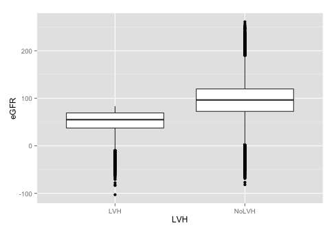
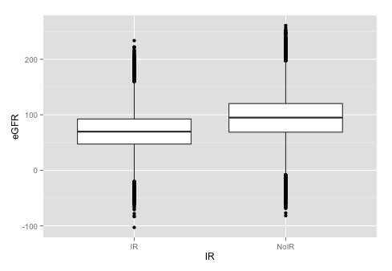
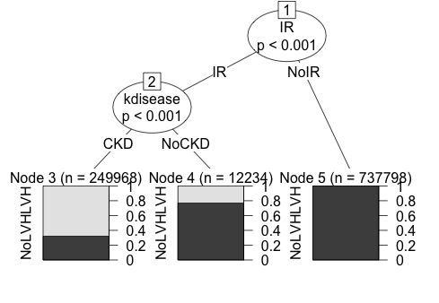

#Data Simulartion Assignment

##Introduction

About [25%](http://www.rightdiagnosis.com/i/insulin_resistance/stats-country.htm) of people in the U.S. have been diagnosed with insulin resistance (IR). Results of this studiy showed that both IR and left ventricular hypertrophy (LVH) existed in early stage early stage chronic kidney disease (CKD) patients. The prevalence of LVH in patients with IR was significantly higher than those without, and patients with LVH had a higher prevalence of IR than those without. The patients with IR or LVH had lower levels of stimated glomerular filtration rate (e-GFR). HOMA-IR had positive correlations with left ventricular mass index (LVMI). Homeostasis  model  assessment  of  insulin  resistance (HOMA-IR)  and Left ventricular mass (LVMI) had negative correlations with e-GFR. IR had a significant correlation with LVH. Furthermore, decline of e-GFR, hypertension and anemia were also associated with both IR and LVH and may have some effects in the mechanism of IR on the development of LVH.

[Effects of insulin resistance on left ventricular hypertrophy in patients with CKD stage 1-3](http://www.ncbi.nlm.nih.gov/pubmed/24839054)

IR: insulin resistance
CKD: chronic kidney disease
LVH: left ventricular hypertrophy

##Simulate a data set

Features:
* Sex
* Age
* Chronic kidney disease (`kdisease`)
* Homeostasis  model  assessment  of  insulin  resistance (`HOMA_IR_score`)
* Insulin resistence (`IR`)
* Left ventricular mass (`LVM`)
* Estimated glomerular filtration rate(`eGFR`)

How are these features related to left ventricular hypertrophy?

##Generate data
```r
generate_dataset <- function(N){ 
  
  sex <- sample(c("M", "F"), N, replace=TRUE, prob=c(0.5, 0.5))
  
  age <- runif(N,14,88)
  
  kdisease <- sample(c("CKD", "NoCKD"), N , replace=TRUE)
  
  eGFRmean<-c(CKD=68.27, NoCKD=107.51)
  eGFRsd<-c(CKD=32.51, NoCKD=32.90)
  eGFR <- rnorm(N,mean=eGFRmean[kdisease], sd=eGFRsd[kdisease])
  
  HOMAmean <- c(CKD=2.284, NoCKD=1.87)  
  HOMAsd <- c(CKD=0.64, NoCKD=0.21)
  HOMAIRscore <- rnorm(N,mean=HOMAmean[kdisease], sd=HOMAsd[kdisease])
  
  IR <- ifelse(HOMAIRscore>2.284, "IR", "NoIR")
  
  sim_LVM<- function(x) { 
    150-0.3*x + ifelse(sex=='F', -15, 0)
    
  }
  
  LVM <- sim_LVM(eGFR)
  
  LVHcutoff<- c(F=110, M=125)
  
  LVH <- ifelse(LVM > LVHcutoff[sex] & IR== 'IR' , "LVH","NoLVH")
  
  data.frame(sex, age, kdisease, eGFR, HOMAIRscore, IR, LVM,LVH)     
}
patient_df<-generate_dataset(1e6)
```

##Exploratory analysis
As all this paper suggets, CKD, IR and LVH, eGFR, and LVM are all related to each other. The following graph are generated in order to better show the relationship between variables in this data set. 

* paitents with LVH have lower levels of stimated glomerular filtration rate (e-GFR) on average
```r
plot_LVH_eGFR<-ggplot(data=patient_df,aes(x=LVH, y=eGFR))+ geom_boxplot()
plot(plot_LVH_eGFR)
```



* patients with IR have lower levels of stimated glomerular filtration rate (e-GFR) on average
```r
plot_IR_eGFR<-ggplot(data=patient_df,aes(x=IR, y=eGFR))+ geom_boxplot()
plot(plot_IR_eGFR)
```



* HOMA-IR has positive correlations with left ventricular mass index (LVM)
```r
fit_IRscore_LVM <- lm(HOMAIRscore~ LVM, data=patient_df)
summary(fit_IRscore_LVM)
```
```r
Call:
lm(formula = HOMAIRscore ~ LVM, data = patient_df)

Residuals:
    Min      1Q  Median      3Q     Max 
-2.7973 -0.3061 -0.0812  0.2304  3.4905 

Coefficients:
             Estimate Std. Error t value Pr(>|t|)    
(Intercept) 1.320e+00  4.372e-03   302.0   <2e-16 ***
LVM         6.516e-03  3.738e-05   174.3   <2e-16 ***
---
Signif. codes:  0 ‘***’ 0.001 ‘**’ 0.01 ‘*’ 0.05 ‘.’ 0.1 ‘ ’ 1

Residual standard error: 0.5116 on 999998 degrees of freedom
Multiple R-squared:  0.02948,  Adjusted R-squared:  0.02948 
F-statistic: 3.038e+04 on 1 and 999998 DF,  p-value: < 2.2e-16
```


* HOMA-IR score has negative correlations with e-GFR
```r
fit_HOMAIRscore_eGFR <- lm(HOMAIRscore~ eGFR, data=patient_df)
summary(fit_HOMAIRscore_eGFR)
```
```r

Call:
lm(formula = HOMAIRscore ~ eGFR, data = patient_df)

Residuals:
    Min      1Q  Median      3Q     Max 
-2.8371 -0.3002 -0.0722  0.2298  3.5404 

Coefficients:
              Estimate Std. Error t value Pr(>|t|)    
(Intercept)  2.323e+00  1.276e-03    1821   <2e-16 ***
eGFR        -2.796e-03  1.331e-05    -210   <2e-16 ***
---
Signif. codes:  0 ‘***’ 0.001 ‘**’ 0.01 ‘*’ 0.05 ‘.’ 0.1 ‘ ’ 1

Residual standard error: 0.5082 on 999998 degrees of freedom
Multiple R-squared:  0.04225,  Adjusted R-squared:  0.04225 
F-statistic: 4.412e+04 on 1 and 999998 DF,  p-value: < 2.2e-16
```


* Left ventricular mass (LVM) has negative correlations with e-GFR
```r
fit_LMV_eGFR <- lm(LVM~ eGFR, data=patient_df)
summary(fit_LMV_eGFR )
```
```r

Call:
lm(formula = LVM ~ eGFR, data = patient_df)

Residuals:
   Min     1Q Median     3Q    Max 
-7.536 -7.507  7.472  7.493  7.523 

Coefficients:
              Estimate Std. Error t value Pr(>|t|)    
(Intercept)  1.425e+02  1.883e-02    7569   <2e-16 ***
eGFR        -2.998e-01  1.965e-04   -1526   <2e-16 ***
---
Signif. codes:  0 ‘***’ 0.001 ‘**’ 0.01 ‘*’ 0.05 ‘.’ 0.1 ‘ ’ 1

Residual standard error: 7.5 on 999998 degrees of freedom
Multiple R-squared:  0.6996,  Adjusted R-squared:  0.6996 
F-statistic: 2.329e+06 on 1 and 999998 DF,  p-value: < 2.2e-16
```


##Regression analysis

Which model best fits data?

* Logistic regresison model?
```r
log_fit<- glm(LVH~ kdisease+IR,data=patient_df, family= "binomial" )
summary(log_fit)
```
```r

Call:
glm(formula = LVH ~ kdisease + IR, family = "binomial", data = patient_df)

Deviance Residuals: 
     Min        1Q    Median        3Q       Max  
-1.72003   0.00003   0.00003   0.00008   1.50760  

Coefficients:
               Estimate Std. Error  z value Pr(>|z|)    
(Intercept)   -0.749359   0.004284 -174.906   <2e-16 ***
kdiseaseNoCKD  1.970090   0.021978   89.641   <2e-16 ***
IRNoIR        20.382864  19.728290    1.033    0.302    
---
Signif. codes:  0 ‘***’ 0.001 ‘**’ 0.01 ‘*’ 0.05 ‘.’ 0.1 ‘ ’ 1

(Dispersion parameter for binomial family taken to be 1)

    Null deviance: 919735  on 999999  degrees of freedom
Residual deviance: 326886  on 999997  degrees of freedom
AIC: 326892

Number of Fisher Scoring iterations: 19
```

* Decision tree?
```r
d_tree_fit<- ctree(LVH~IR+kdisease,data=patient_df)
plot(d_tree_fit)
```


